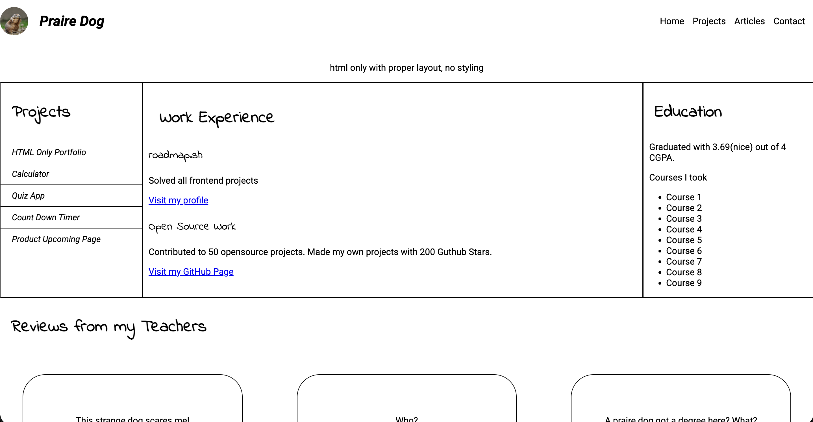

# Projects

This repository contains my projects built following the front-end devolper path on roadmap.sh

## List

<a href="https://roadmap.sh/projects/single-page-cv">Single-Page Cv Project on roadmap.sh</a>

Click on the image to view the project

  

<a href="https://roadmap.sh/projects/basic-html-website">Basic HTML Website on roadmap.sh</a>

Click on the image to view the project

  

<a href="https://roadmap.sh/projects/portfolio-website">Personal Portfolio on roadmap.sh</a>

Click on the image to view the project

  

<a href="https://roadmap.sh/projects/changelog-component">Changelog Component on roadmap.sh</a>

  

