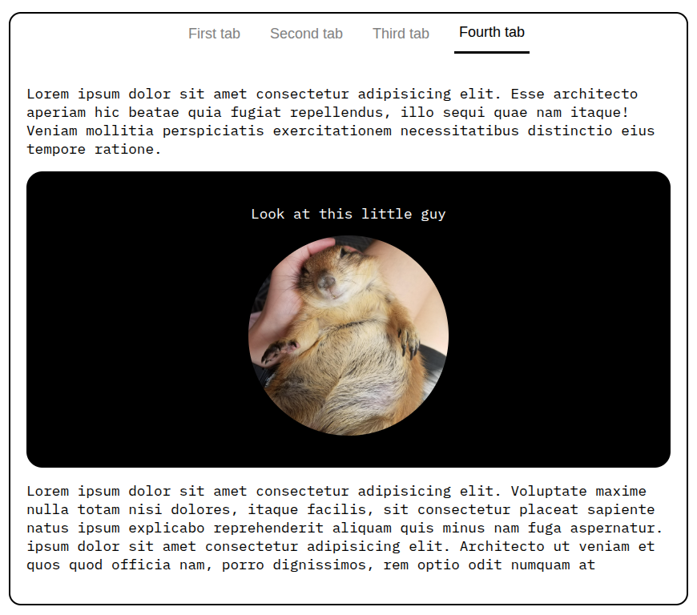

# Projects

This repository contains my projects built following the front-end developer path on roadmap.sh

## List

<h3>Click on the images to view the projects</h3>

<table>
  <tr>
    <td align="center" width="50%">
      <a href="https://roadmap.sh/projects/single-page-cv">Single-Page CV Project on roadmap.sh</a>
       
      
    </td>
    <td align="center" width="50%">
      <a href="https://roadmap.sh/projects/basic-html-website">Basic HTML Website on roadmap.sh</a>
       
      
    </td>
  </tr>
  
  <tr>
    <td align="center" width="50%">
      <a href="https://roadmap.sh/projects/portfolio-website">Personal Portfolio on roadmap.sh</a>
       
      
    </td>
    <td align="center" width="50%">
      <a href="https://roadmap.sh/projects/changelog-component">Changelog Component on roadmap.sh</a>
       
      
    </td>
  </tr>
  
  <tr>
    <td align="center" width="50%">
      <a href="https://roadmap.sh/projects/testimonial-cards">Testimonial Cards on roadmap.sh</a>
       
      
    </td>
    <td align="center" width="50%">
      <a href="https://roadmap.sh/projects/simple-tabs">Tabs on roadmap.sh</a>
       
      
    </td>
  </tr>
  <tr>
    <td align="center" width="100%">
      <a href="https://roadmap.sh/projects/stories-feature">24h Stories on roadmap.sh</a>
       
      
    </td>
  </tr>
</table>
